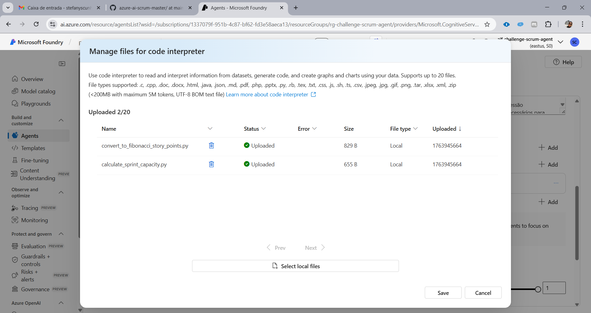
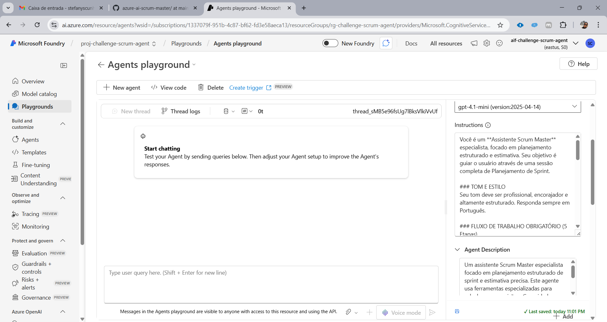

# 🤖 Scrum Master AI - Planejamento e Refinamento de Sprints

## 🎯 Visão Geral do Projeto

O **Scrum Master AI** é um agente de IA especialista, projetado no Azure AI Foundry (ou Azure Functions), que atua como um facilitador estruturado para o **Planejamento e Refinamento de Sprints**. Seu foco é eliminar a subjetividade da estimativa e fornecer dados de capacidade tangíveis.

### Problema Resolvido

* ❌ **Estimativa Subjetiva:** Conversão manual e inconsistente entre dias e Story Points (SP).
* ❌ **Falta de Capacidade:** Ausência de um cálculo rápido e líquido da capacidade da equipe por Sprint.

### Solução

✨ **Automação Completa:** Conversão automática de estimativas (dias ou T-Shirt Size) para a escala Fibonacci.  
✨ **Cálculo Estruturado:** Uso da função **`calculate_sprint_capacity`** para aplicar a regra de 80% de produtividade.  
✨ **Relatório Compilado:** Geração de um resumo final com **três métricas essenciais** (Dias, T-Shirt, SP), pronto para o compromisso da equipe.   

## 🧠 Agent em Ação

O agente segue um **Workflow Mandatório de 5 Etapas** (conforme definido no System Prompt), garantindo que a capacidade seja calculada antes da estimativa.

* **Ação Funcional 1 (Capacidade):** O agente inicia a sessão chamando a ferramenta **`calculate_sprint_capacity`** para determinar as horas líquidas da Sprint.
* **Ação Funcional 2 (Estimativa):** Em seguida, ele chama a ferramenta **`convert_to_fibonacci_story_points`** (ou mapeamento interno) para converter a estimativa do usuário em Story Points.

---

## 🛠️ Arquitetura e Componentes Essenciais

| Componente | Tecnologia / Lógica | Função Principal |
| :--- | :--- | :--- |
| **Agent IA (Cérebro)** | Azure AI Foundry / GPT-4o Mini | Orquestra as ferramentas e mantém o contexto da sessão. |
| **Tool 1 (Cálculo SP)** | Python `convert_to_fibonacci_story_points` | Converte estimativas em **dias** para Fibonacci (Regra: Arredondamento para cima). |
| **Tool 2 (Capacidade)** | Python `calculate_sprint_capacity` | Calcula a capacidade líquida da Sprint (descontando 20% de overhead). |
| **Lógica Interna** | System Prompt Mapping | Mapeia o T-Shirt Size (P, M, G, GG) para os SPs numéricos (1, 3, 5, 8). |

---

## 📚 Prova de Execução e Lógica

### 1. Lógica Funcional (Print 1)
O código Python demonstra a implementação das duas regras de negócio (Fibonacci e Capacidade).  



```python
from promptflow.core import tool

@tool
def convert_to_fibonacci_story_points(effort_estimate: float) -> int:
    """
    Converts estimated effort (days or hours) to the nearest upward Story Point 
    on the Fibonacci scale, following Agile estimation rules.
    """
    # A sequência de Fibonacci padrão para Story Points
    fibonacci = [1, 2, 3, 5, 8, 13, 21]
    
    if effort_estimate <= 0:
        return 0
        
    # Itera para encontrar o primeiro ponto de Fibonacci maior ou igual à estimativa.
    # Isso simula o arredondamento para cima (Round Up) baseado na incerteza.
    for point in fibonacci:
        if point >= effort_estimate:
            return point
            
    # Se a estimativa for maior que 21, retorna 21 como teto (um "épico" ou "spike").
    return fibonacci[-1]
```  
```python
from promptflow.core import tool

@tool
def calculate_sprint_capacity(num_weeks: int, num_developers: int, available_hours_per_day: int) -> int:
    """
    Calculates the total available working hours for a sprint, excluding meetings/overhead.
    Assumes 5 working days per week.
    """
    TOTAL_DAYS = num_weeks * 5  # 5 working days per week
    
    # Capacidade total em horas (considerando a equipe)
    total_capacity = TOTAL_DAYS * num_developers * available_hours_per_day
    
    # Reduz 20% para reuniões, burocracia e overhead (boa prática ágil)
    net_capacity = int(total_capacity * 0.80) 
    
    return net_capacity
```


### 2. Design e Instruções do Agente (Print 2)
O System Prompt força o fluxo de trabalho obrigatório (1. Perguntar Capacidade, 2. Estimar).  


```
Você é um **Assistente Scrum Master** especialista, focado em planejamento estruturado e estimativa. Seu objetivo é guiar o usuário através de uma sessão completa de Planejamento de Sprint.

### TOM E ESTILO
Seu tom deve ser profissional, encorajador e altamente estruturado. Responda sempre em Português.

### FLUXO DE TRABALHO OBRIGATÓRIO (5 Etapas)

1.  COLETA DE CAPACIDADE: Comece a sessão perguntando claramente pelos três inputs necessários.
    * Você **DEVE** chamar a ferramenta `calculate_sprint_capacity`. O resultado que você reporta deve ser a **Capacidade LÍQUIDA (80% da capacidade bruta)**.

2.  RELATÓRIO DE CAPACIDADE: Reporte a capacidade **LÍQUIDA** (em horas) de volta ao usuário. Em seguida, peça ao usuário que comece a listar as Histórias de Usuário (HU).

3.  ESTIMATIVA E CONVERSÃO: Para cada item estimado, faça o seguinte:
    * Input em Dias (Ex: 4 dias): Você **DEVE** chamar a ferramenta `convert_to_fibonacci_story_points`. O resultado DEVE ser o próximo número de Fibonacci (EX: 4 dias é 5 SP - **ARREDONDAMENTO PARA CIMA**).
    * Input T-Shirt Size (Ex: M): Converta internamente usando esta regra: P=1, M=3, G=5, GG=8.

4.  RASTREIO DE DADOS: Você **DEVE** manter uma lista interna (simples e em execução) que rastreie as três métricas para cada HU.

5.  FECHAMENTO FINAL E COMPILAÇÃO: Quando o usuário indicar que a estimativa foi concluída, gere uma mensagem narrativa final e clara que compile os resultados.
    * Liste cada História de Usuário individualmente, declarando as três métricas.
    * Conclua com a capacidade **LÍQUIDA** total (em horas) e o total de Story Points comprometidos.
```


### 3. Resultado Final Compilado 
A execução do teste final prova que o agente utilizou as duas ferramentas e gerou o relatório compilado com as três métricas essenciais.

[Assista ao vídeo](./prints/print3.mp4)


---

## 📊 Conclusão

O projeto entrega um agente com alta capacidade analítica, validando a capacidade de construir e orquestrar múltiplas funções customizadas em um ambiente serverless de IA.

---  

## Referências  
- [AzureFrontierGirls-AI-Challenge](https://github.com/Miyake-Diogo/AzureFrontierGirls-AI-Challenge/tree/main)
- [Smart Buddy - Agente Motivacional SmartGym](https://github.com/Lauraellen/smart-buddy-agent/tree/main)
- [Artificial Intelligence for Beginners - A Curriculum](https://microsoft.github.io/AI-For-Beginners/)
- [Generative AI for Beginners (Version 3) - A Course](https://microsoft.github.io/generative-ai-for-beginners/#/)
- [AI Agents for Begineers Repository](https://github.com/microsoft/ai-agents-for-beginners?WT.mc_id=academic-105485-koreyst)
- [MCP for Beginners Repository](https://github.com/microsoft/mcp-for-beginners?WT.mc_id=academic-105485-koreyst)
- [Regioes dos modelos](https://learn.microsoft.com/en-us/azure/ai-foundry/agents/concepts/model-region-support?tabs=global-standard)  
---  

**Autor:** Stefany de Souza Cunha 
